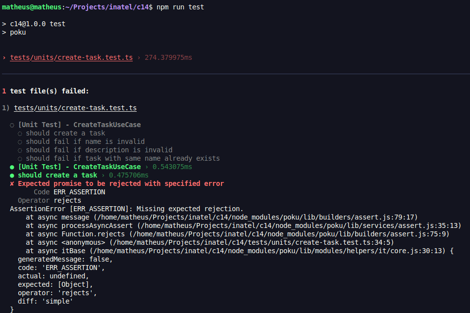
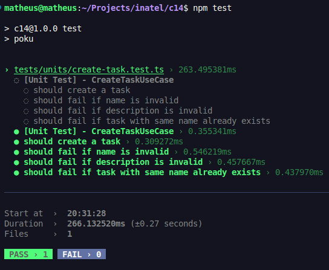

# Projeto TypeScript

## Como executar em ambiente local?

### Instalação do NodeJs

Primeiro, precisamos garantir que o [NodeJs](https://nodejs.org/en) esteja instalado no seu ambiente.

### Obter o código do projeto

Depois, é necessário obter o código do projeto da maneira que preferir, via `git clone` ou até mesmo baixar o código em um `zip`.

### Instalando as dependências

Depois, é necessário instalar as dependências do projeto com o gerenciador de pacotes que preferir, nesse caso, usarei o `npm`:

```bash
npm i
```

## Build

Para gerar a build, é necessário rodar o comando:

```bash
npm run build
```

> Pode notar que a pasta `dist` foi criada no diretório raiz.

## Execução

Para executar o projeto, é necessário rodar o comando:

```bash
node dist
```

## ✅ Pronto! O Projeto está sendo executado!

## Testes

Para executar os testes unitários do projeto, utilize o comando:

```bash
npm run test
```

## Resolução de Conflito de Dependências - Caso Real (19/08/2025)

### O Problema

Durante o desenvolvimento, ocorreu o seguinte conflito no `package.json`:

1. **Estado inicial**: O projeto tinha apenas dependências de desenvolvimento (`@types/node`, `typescript`)
2. **PR mergeado na main**: Alguém adicionou `express`, `cors` e suas tipagens (`@types/express`, `@types/cors`)
3. **Commit local**: Eu instalei e commitei a dependência `zod` para validação
4. **Conflito**: Ao tentar sincronizar com a main, houve conflito no `package.json`

### Como Foi Resolvido no VS Code

1. **Identifiquei o conflito**: VS Code mostrou marcadores de conflito no `package.json`
2. **Estado do conflito**:

   ```json
   "dependencies": {
     "zod": "^4.0.17"
   }

   "dependencies": {
     "cors": "^2.8.5",
     "express": "^5.1.0"
   }
   ```

3. **Resolução**: Usei "Accept Both Changes" no VS Code para manter todas as dependências
4. **Resultado final**:
   ```json
   "dependencies": {
     "zod": "^4.0.17",
     "cors": "^2.8.5",
     "express": "^5.1.0"
   },
   "devDependencies": {
     "@types/cors": "^2.8.19",
     "@types/express": "^5.0.3",
     "@types/node": "^24.2.1",
     "typescript": "^5.9.2"
   }
   ```
5. **Pós-resolução**: Executei `npm install` para garantir que todsas as dependências fossem instaladas

## Testes Falharam após Regressão do Código - Caso Real (01/07/2025)

### O Problema

Foi feito um PR com um código em que foi removida a obrigatoriedade da descrição para uma task.

Após rodar os testes unitários com o comando `npm run test`, eles falharam:



### Como Foi Resolvido

Para os testes voltarem a passar, foi necessário retornar a obrigatoriedade da descrição para a criação de uma task.

Rodando os testes novamente, vemos que eles passam:


